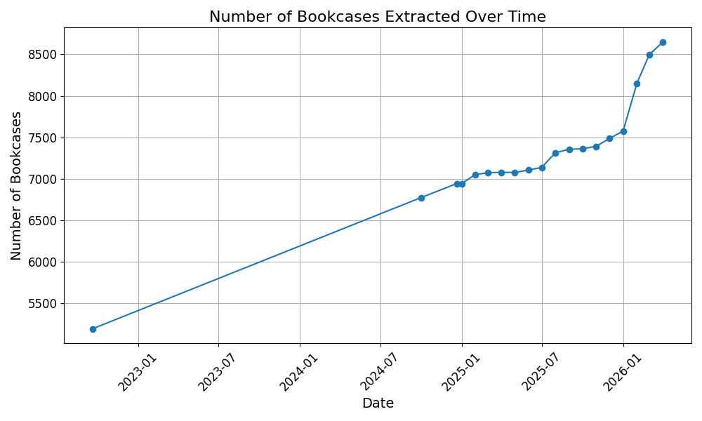
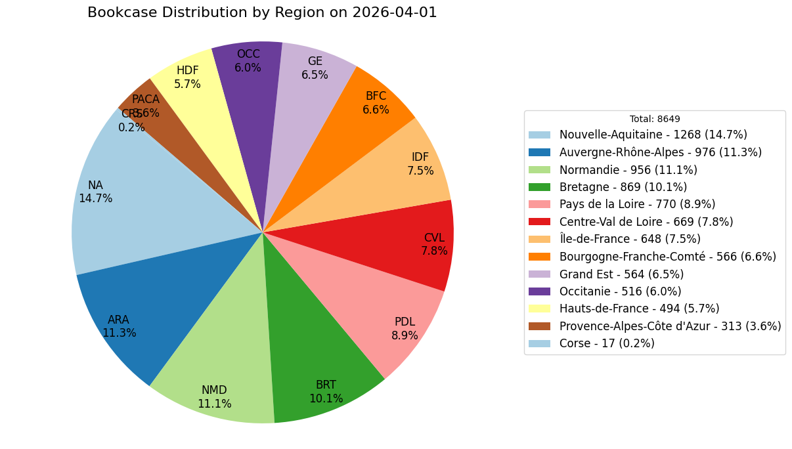

# bookcases-zonelivre

**Data last updated on: 2025-10-01**

Bookcases from zonelivre: https://boite.a.livres.zonelivre.fr/

These bookcases are mainly in France and French-speaking countries. You can display them in OsmAnd, JOSM, uMap, and more.




## ⚠️ DO NOT IMPORT INTO OPENSTREETMAP! ⚠️

Do not import directly in OSM. Verify each bookcase in person before adding it to OSM.

## How to Use the Data

Use the data to display bookcases in OsmAnd, JOSM, uMap, and more. Visit them in person and add or update them on OpenStreetMap.

### Using OsmAnd

**Note:** To avoid lag, do not use `bookcases.gpx` file. Instead, use the region-specific GPX files, such as `Bretagne.gpx`.

1. Open the `bookcases` folder for the latest data.
2. Download a region-specific GPX file (e.g., `Bretagne.gpx`).
3. Copy the GPX file to your device.
4. Open OsmAnd.
5. Go to Favorites.
6. Use the **+** (import) button.
7. Select the GPX file.
8. Bookcases are now displayed on the map.


### Using JOSM

1. Open the `bookcases` folder for the latest data.
2. Download the `bookcases.geojson` file.
3. Open JOSM.
4. Use the Open File button.
5. Select the `bookcases.geojson` file.
6. Bookcases are now displayed on the map.

## How to Update the Data

1. Install the necessary Python libraries:
    ```sh
    pip install beautifulsoup4 fake_useragent geojson matplotlib pandas selenium shapely
    ```
2. Run `1_fetch_bookcases.py` to fetch and create `bookcases.geojson`.
3. Run `2_filter_by_region.py` to split the bookcases into GeoJSON files for each French region.
4. Run `3_create_OsmAnd_gpx.py` to convert each GeoJSON file into an OsmAnd GPX file.
